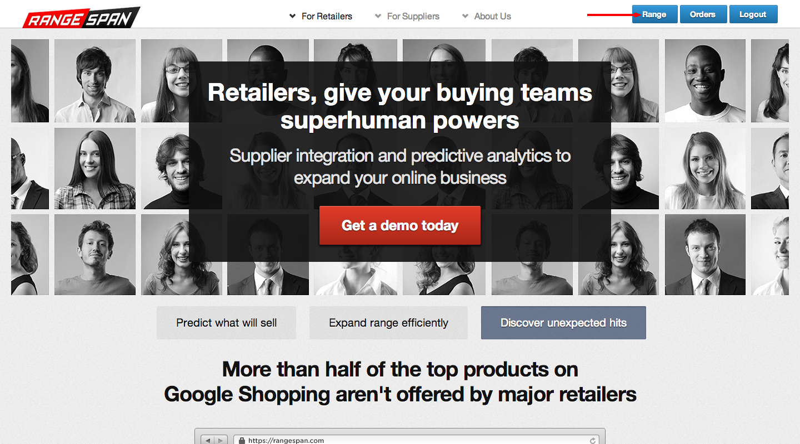

Overview
========

Retailers can browse the rangespan catalogue by logging in to `rangespan.com/range <http://www.rangespan.com/range>`_.

This page details how Rangespan's search interface helps retailers discover new products and market opportunities.

The next section covers tools for `launching products via Rangespan <Launching%20Products.html>`_.

Product Research
================

Rangespan offers a searchable Product Universe database of more than 30 million branded general merchandise products available online in the UK. Once you're logged in, click on the 'range' button to access Rangespan Search.

Retailers can use the database to strengthen their understanding of products that they don't already offer, by brand, subcategory or price point.  Retailers can provide a list of the barcodes and selling prices of their existing range to retailer-team@rangespan.com in order to be able to filter those products from the Product Universe and focus on products not already offered.

On the left hand side of the page, you can use filters to retrieve a list of relevant products:

Popularity
----------
All products are tagged with a **RangeRank** score based on the probability it will sell well in the future.  Rangespan tracks hundreds of millions of customer signals online, such as customer reviews and search engine data, to feed into the RangeRank algorithm. RangeRank 1 products are most likely to sell, with RangeRank 4 products being least likely to sell - on average RangeRank 1 products out-sell RangeRank 4 products by 18 to 1.

.. image:: ../search_rangerank.png
    :width: 750px

Text-based search
-----------------
Find a product using keywords. For example, 'lamp' returns products like lamps and lamp bulbs. Rangespan search uses key data about the product such as manufacturer name and item name.

.. image:: ../search_text.png
    :width: 750px

Category filters
----------------
Items are classified into a category taxonomy derived from Google's Shopping Search taxonomy. Items are automatically assigned based on attribute input from suppliers and crawled websites. Because of the large number of items and variety of source data categorisation will not be 100% accurate. You can notify Rangespan of errors at analysts@rangespan.com. Items selected for launch will be manually checked for accurate category assignment.
For example, you could go down the category tree from Home & Garden to Lighting to Table Lamps as below:

.. image:: ../search_categories.png
    :width: 750px

Manufacturer filters
--------------------
Items are assigned to a manufacturer or brand; whichever is most easily recognised. These can be searched for explicitly ( `see above <integration%20methods.html#text-based-search>`_ )

.. image:: ../search_manufacturers1.png
    :width: 500px
        

.. image:: ../search_manufacturers2.png

Product Prices
--------------
Where available we display the latest known amazon price, `your retail price <integration%20methods.html#availability-filters-range-matching>`_, and the rangespan cost price. All prices are inc. VAT and inc. Shipping.

.. image:: ../search_prices.png

Rangespan Offers
==================

Retailers can use this search interface to launch products sourced from Rangespan. To make this process easier, you can look at all of the factors described above, as well as:

- Competitiveness filters
- Availability filters / range matching
- Download and manage product data in excel
- Build and share product shortlists
- Refer suppliers to Rangespan

Competitiveness filters
-----------------------
Where Amazon prices are available, retailers can filter uncompetitive products from their selection. Note that drop-shipped products are more expensive than products you get in stock, to account for inventory risk and shipping costs.

.. image:: ../search_competitiveness.png
    :width: 750px

Price filters
-------------

When looking at competitiveness, retailers often segment products by price band. The 'Cost Band' allows a user to limit search results to cost prices within a certain range. For example, a buyer might want to look for competitive mid-tier iPhone cases:

.. image:: ../search_costband.png
    :width: 750px

Market availability
-------------------
Products selected by a retailer are shown as 'in my range'. In addition, retailers on plan B and above can submit their in-stock products to rangespan, which we will map to our product universe. This allows buyers to avoid duplicate selections, and helps inform conversations with key suppliers, regardless of whether the product is sourced from Rangespan.

.. image:: ../search_availability.png
    :width: 750px

Refer suppliers to Rangespan
----------------------------
If there are particular brands or ranges that do not have available offers from the suppliers already integrated to Rangespan, Retailers can refer suppliers to Rangespan for integration support, using the material and forms linked below:
 - `Rangespan's supplier documentation <https://www.rangespan.com/docs/supplier>`_
 - `Supplier referral form. <https://www.rangespan.com/retail_introduced_supplier_form/>`_
 - `Supplier sign-up form. <https://www.rangespan.com/supplier_account_setup_form/>`_

