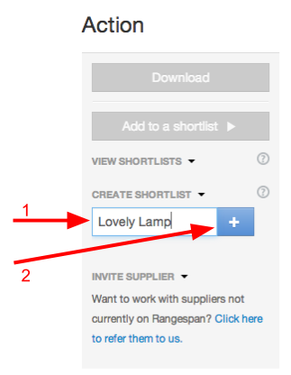
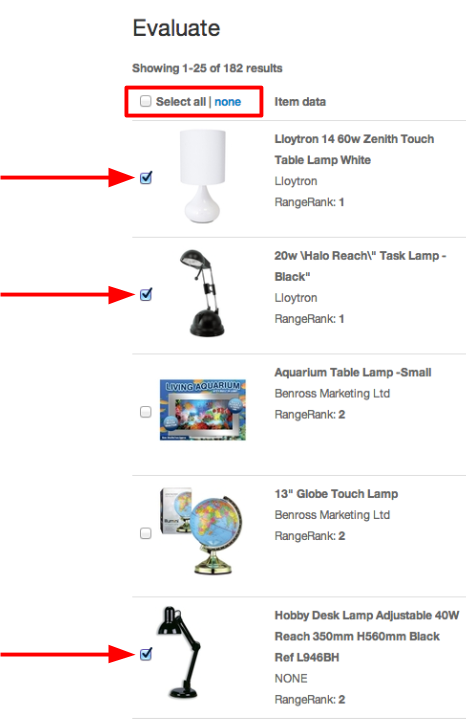
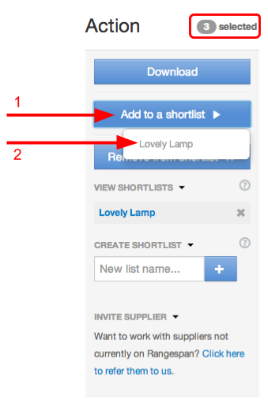
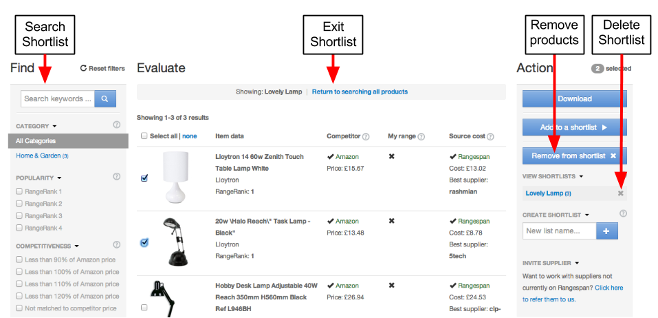
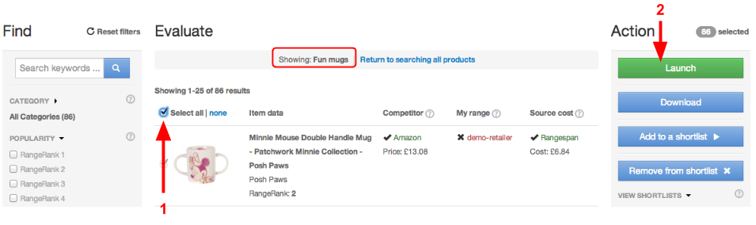
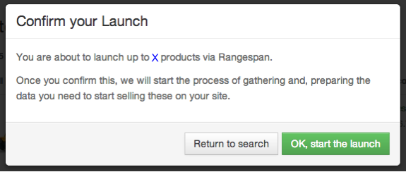
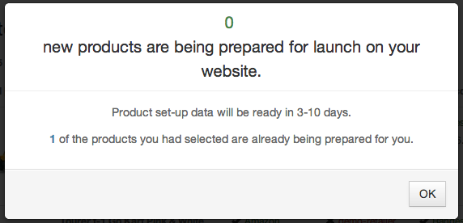

Overview
========
Retailers can also use `rangespan.com/range <http://www.rangespan.com/range>`_ to make product selections

This page details how retailers can use the 'shortlist' tool to build and launch selected products.

The next section covers `Product Data. <Product%20Data.html>`_

Building shortlists
===================
Making a selection is often an iterative process, involving more than one person. Rangespan allows retailers to set aside named lists of products, called shortlists for further review.

The most common use of a shortlist is to combine the output of several search results. There are a number of different use cases:

- **Combine Multiple Search Results**: A buyer can create a shortlist for phone cases, and add products one by one or in batches, based on a number of different searches.
- **Save and share your work**: Buyers can choose products they find interesting and save these for further review. This allows different users to look at products at different times. 
- **Wishlists**: A buyer can single out products that are particularly interesting but have an uncompetitive cost price. Flagging these to Rangespan or to suppliers directly is an efficient way to push suppliers to provide better cost prices.

Creating a shortlist
--------------------
Give your shortlist a descriptive name. A useful convention is to add a date (e.g. Electronics - January 2014).

Making a selection
------------------
Once you've used the search options to filter down to a small list of products, you can select all of the corresponding products, or target products one by one. Selections stay when you change pages; you can click 'None' (as in the box below) to clear your selection. 

Adding selections to a shortlist
--------------------------------
You can add any selection to any shortlist: simply click 'Add to a shortlist' and select the relevant list from the drop-down box. Note that any duplicates are ignored.

Managing shortlists
-------------------
Once you've made a shortlist, you can search within that shortlist specifically, using all the same tools as when searching the entire catalog. This makes it easy to remove the least relevant products, for example. When a shortlist has served it's purpose, you can delete it by clicking on the 'x' next to it's name.

Download product data
=====================
Rangespan allows retailers to access selections in csv form. To do so, retailers can click the 'download' button to get access to their **current selection**. Save your work often! We recommended to first create a shortlist, then to download the content of that shortlist.

Launch product selections
=========================
Rangespan makes it easy to launch any number of products - just make a selection and click the launch button. Note that you can launch an entire shortlist (recommended) by selecting all the products in a shortlist. You can also launch a subset of a shortlist, or even products outside of a shortlist too.

If all goes well:

You can filter newly launched products in 'My Selection' after 24-48h. If you do launch a selection with a product you've already launched, you'll get a notification and the rest of the selection will go through, see an example message below:

