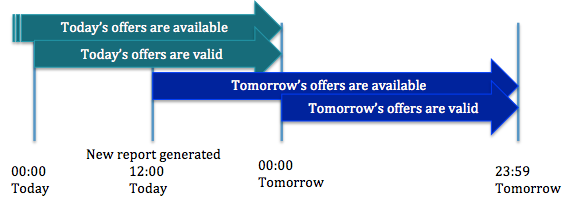

Rangespan Consolidated Offers
=============================

Rangespan aggregates offers from our suppliers to provide retailers with the latest price and inventory data. For SME Retailers, costs are set daily, and availability is refreshed several times a day. Enterprise retailers can set up the cost change process to be daily or weekly.

Each retailer listing has a 'state' to make it easy to understand the overall availability status for a retailer. A listing is 'New' while it is being set up, 'Live' once it is buyable, 'Suspended' if it is temporarily removed from sale, and 'Terminated' once a retailer has informed Rangespan they are no longer selling that product.

Prices are generated at midday British time, with cost prices that will apply for 24 hours, starting from Midnight:

For more detail on how to access prices or inventory for a RIN, see the relevant section in the `API docs <https://www.rangespan.com/docs/api/v2/index.html#offers>`_ or `SFTP docs <http://rangespan-retailer-integration.readthedocs.org/en/latest/_SFTP.html#offers>`_.
