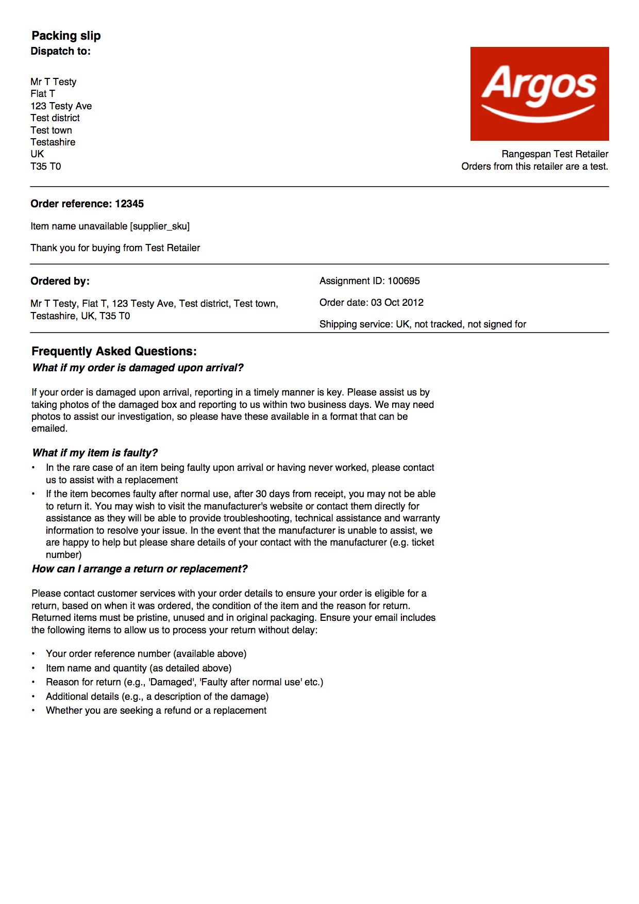
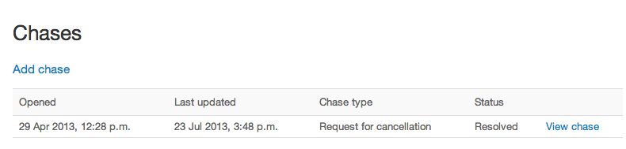
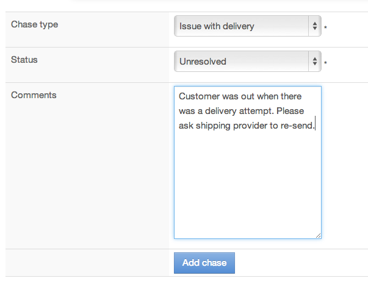
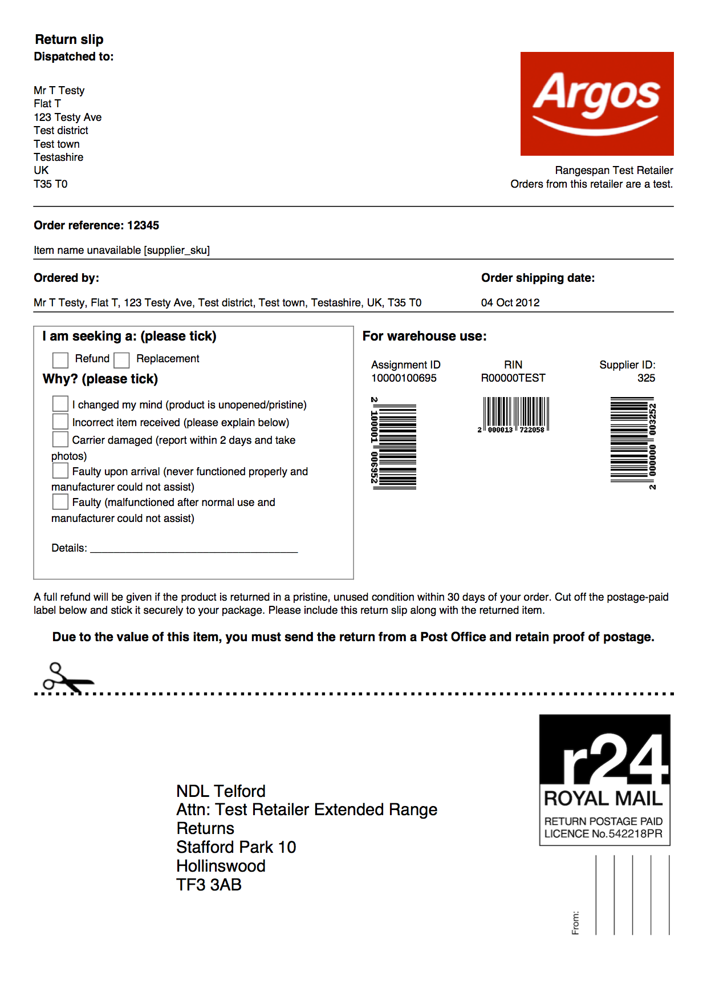

Rangespan Order Management
==========================

For technical details, see the relevant sections for `API Integration <https://www.rangespan.com/docs/api/v2/index.html#orders>`_ or `SFTP Integration <http://rangespan-retailer-integration.readthedocs.org/en/latest/_SFTP.html#orders>`_. This article describes how retailers can use the website to track and manage orders, and what happens in practise.

Placing an order
----------------

Once an order is placed, Rangespan's system assigns it to the best available supplier, typically within 5 minutes of the order being placed by the retailer. 

.. sidebar:: Supplier Performance

    Rangespan monitors agrregate fulfilment rates and processing times: this influence whether they get an order or not. We require that suppliers ship the item within 2 business days for standard delivery methods and within 1 day for expedited methods.

The shipping method for the order is set based on the cost price of the item. An item worth less than 40 GBP can be shipped un-tracked, unsigned. Items with a cost price between 40 GBP and 100 GBP need to be tracked, and any order worth above 100 GBP needs to be tracked and signed for. Suppliers are responsible for getting the item to the end customer, and may upgrade the shipping method in some cases.

The 'placed date' submitted by the retailer will be used to look up the cost price. This feature exists only to allow retailers to keep up-to-date pricing and availability for week-end orders even if the orders themselves are submitted a day or two later.

Order Status
------------

You can access a list of in-progress orders by making an `API call <https://www.rangespan.com/docs/api/v2/#get-details-for-an-order>`_, or on `Rangespan's website <https://www.rangespan.com/orders/retailer>`_. Retailers are notified of any updates on their orders on a daily schedule via `SFTP order notifications <http://rangespan-retailer-integration.readthedocs.org/en/latest/_SFTP.html#order-notifications-overview>`_. 

Rangespan breaks a retailer order into single rangespan orders with one unit of one sku. These are grouped back in any API responses, but the individual components are what we will most often refer to as 'orders'.

Orders will be in one of the following states:

- **Pending**: Rangespan's system is processing these orders. These have not yet been assigned to a supplier for shipment."
- **Processing**: Orders have been assigned to a supplier for shipment. Before returning a product, some suppliers might prefer a replacement to a refund. In these cases the order is placed into 'Processing' again.
- **At Risk**: Rangespan escalates any issues with 'At Risk' orders. Usually, this involves following up with our vendors.
- **Shipped**: Order has been shipped. Depending on the shipping method, it can be 1-3 days before the customer receives the item. If the supplier uses a tracked delivery method (higher value orders) tracking details are made available from the time an order enters this state.
- **Cancelled**: A cancelled order has not yet been shipped. Credit will be provided for any orders that have already been invoiced.
- **Refunded**: A customer returns the goods within the agreed terms. An order that is refunded will show up as 2 lines in the invoice: once on the sale, and once for the refund deduction.
    
Orders move between states as seen in this figure:

.. image:: images/order_states.png

Cancelling an order
-------------------

Orders can be cancelled via our `API <https://www.rangespan.com/docs/api/v2/#cancel-an-order>`_, or via the Rangespan website (see chases). It is not currently possible to cancel orders via SFTP.

In most cases, cancellations can be applied immediately. If a cancelation is sent *after* the supplier has dispatched the item, Rangespan's operations team will notify the retailer to request that the customer return the product, instead.

Delivery Process
----------------

Each delivery is in plain packaging and includes a generic or retailer-branded packing slip (depending on the retailer's subscription plan). Retailer-branded packing slips include the retailer's customer contact details and other desired messaging. You can see an example packing slip below.

Customer Enquiries
------------------

Rangespan's fulfilment performance team resolves issues escalated from the retailer's customer service team. Escalations are referred to as 'retailer chases'. Each order page on Rangespan.com includes an overview of any chases on this order, the option to 'Add chase' or to get detailed information on a chase by clicking 'View chase'.

Chases allow retailers to create or comment on chases. This creates a reliable history of each interaction (including Rangespan responses). Rangespan will also notify the retailer of any changes to these chases via email, so that resolutions can be actioned efficiently. New chases are 'unresolved', once the issue has cleared to everyone's satisfaction the chase is marked resolved.

For example see below:

Order Returns
-------------

Physical Process
++++++++++++++++

Rangespan manages all returns centrally through our 3rd Party Logistics partner Norbert Dantressangle (NDL). Returned items are graded objectively and grouped for bulk shipment back to suppliers. This also makes it easy for customers to return any Rangespan sourced orders, even if the items were sent from different suppliers.

Communicating Returns Information
+++++++++++++++++++++++++++++++++

Retailers should inform Rangespan of any returns. Most often, Rangespan will provide the retailer or customer with a freepost label (see example below). For bulky items, Rangespan will arrange a collection for the customer's return.

For most returns received at Rangespan's facility, retailers are notified of the return the same working day. Some returns are held for further inspection (e.g. products returned without the right paperwork, or very high value products marked 'faulty'). At any time, retailers can query Rangespan's API or go to the Rangespan website for a list of refunded orders.

Retailers can use the order notification feed as a trigger to process customer refunds.

In the rare cases where products are returned outside of the terms set out in the retailer agreement, Rangespan can either return the products to customers, or review with the retailer on a case-by-case basis. Products not sent back to customers can be sent to the retailer's warehouse or preferred liquidation channel. This can happen if a customer returns a non-faulty good more than 30 days after receiving the product, or if the product is in one of the categories not covered by distance selling regulation (e.g. Software products with a broken seal), or if the product is damaged by customer misuse. 

