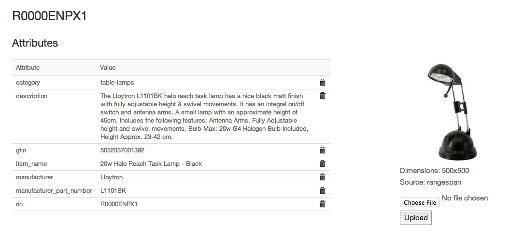
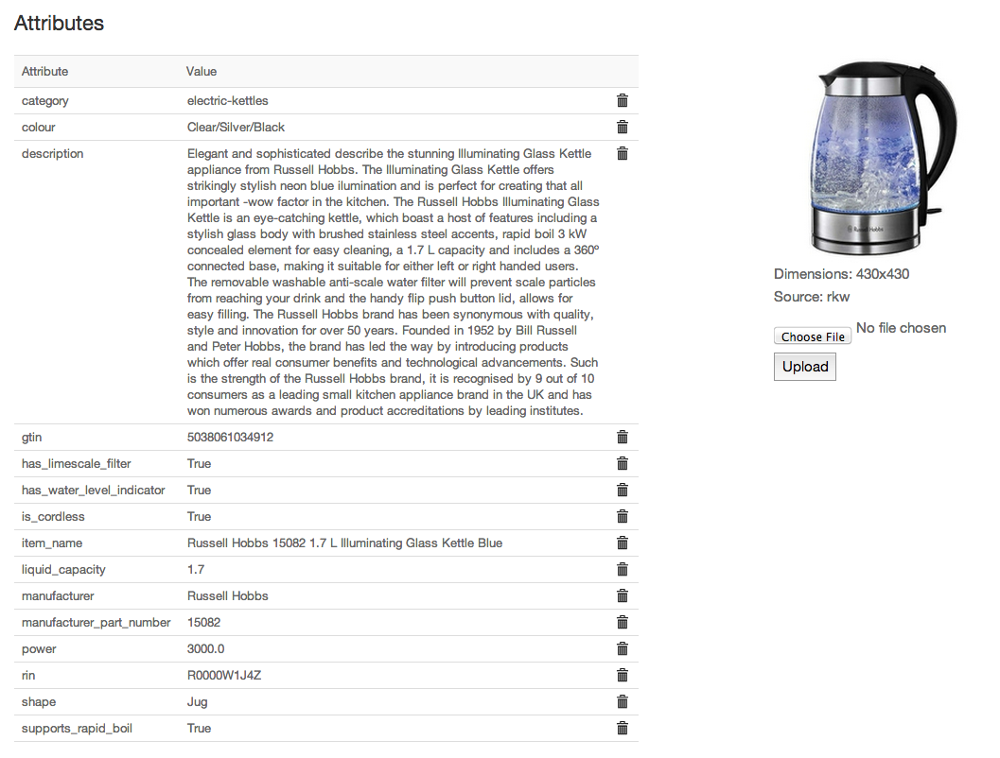
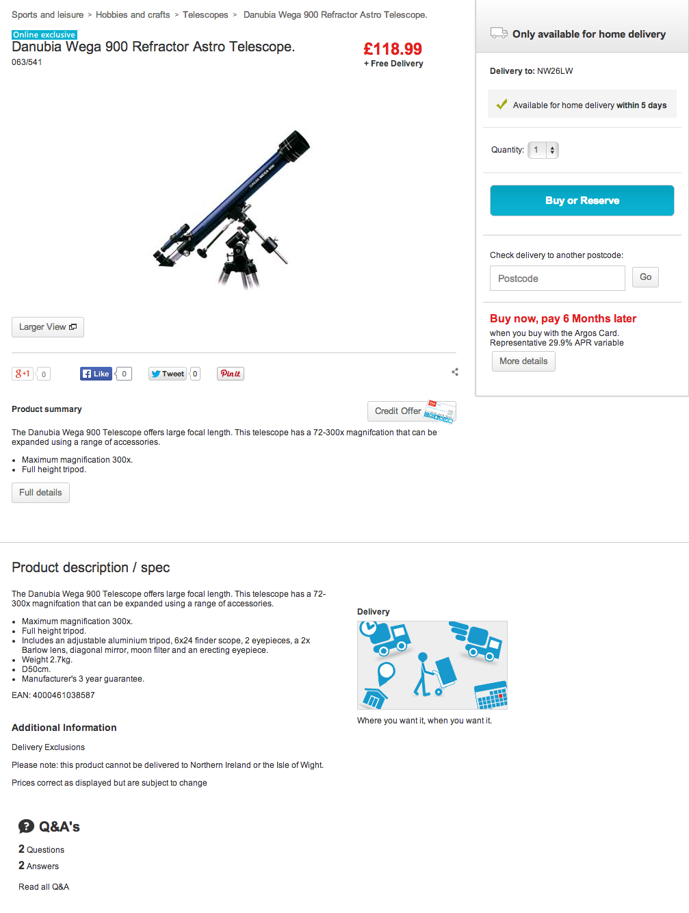

Rangespan Product Data
======================

Rangespan works closely with suppliers and manufacturers to provide our retailers with complete and accurate product data.

Basic Attributes
----------------

When a product is selected by a retailer, Rangespan ensures we have the following basic attributes:

- Unique Identifier info. This can be:
    - A GTIN
    - Both the Manufacturer and the Manufacturer Part Number
- Category
- Item name
- Description
- an image 

See the relevant `FTP <http://rangespan-retailer-integration.readthedocs.org/en/latest/_SFTP.html#catalog-basic-overview>`_ / `API <https://www.rangespan.com/docs/api/v2/index.html#catalog>`_ sections.

For example:

Extended Attributes
-------------------

Where relevant Rangespan will store specific facts about a product (usually, these will be category specific attributes). We communicate the raw values back to our SME retailers through the `API <https://www.rangespan.com/docs/api/v2/index.html#catalog>`_ or in the `extended catalog file <http://rangespan-retailer-integration.readthedocs.org/en/latest/_SFTP.html#extended-catalog-overview>`_ dropped on the relevant SFTP folder.

For example:

Custom Templates
----------------

Enterprise retailers can request custom data templates following their own format definitions. The guidelines are sent to Rangespan for each new category or product type that is selected. Rangespan will map the retailer's category to our internal taxonomy, and complete attribute templates as specified.

Retailers should provide the list of relevant attributes and list out any formatting requirements or restrictions. It's important to confirm how to treat attributes that are not applicable to a particular sku. 

For example: an Argos telescope listing might specifically require a formatted maximum magnification.

