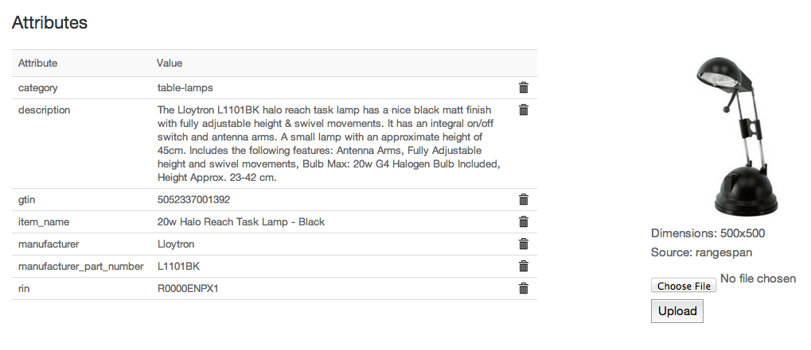

Rangespan Product Data
======================

Rangespan works closely with suppliers and manufacturers to provide our retailers with complete and accurate product data.

Basic Attributes
----------------

When a product is selected by a retailer, Rangespan ensures we have the following basic attributes:

- Unique Identifier info. This can be:
    - A GTIN
    - Both the Manufacturer and the Manufacturer Part Number
- Category
- Item name
- Description
- an image 

See the relevant `FTP <http://rangespan-retailer-integration.readthedocs.org/en/latest/_SFTP.html#catalog-basic-overview>`_ / `API <https://www.rangespan.com/docs/api/v2/index.html#catalog>`_ sections.

For example:

Extended Attributes
-------------------

Where relevant Rangespan will store specific facts about a product (usually, these will be category specific attributes). We communicate the raw values back to our SME retailers through the `API <https://www.rangespan.com/docs/api/v2/index.html#catalog>`_ or in the `extended catalog file <http://rangespan-retailer-integration.readthedocs.org/en/latest/_SFTP.html#extended-catalog-overview>`_ dropped on the relevant SFTP folder.

For example:

Custom Templates
----------------
